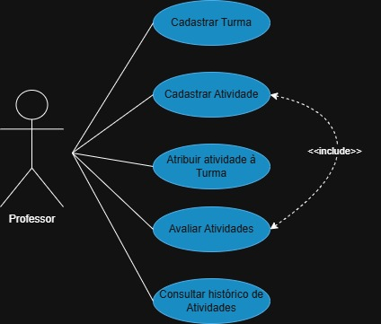
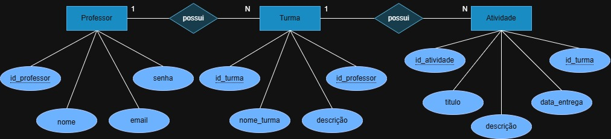

# Sistema de Gestão de Turmas e Atividades

## Diagramas do Sistema

### UML (Diagrama de Casos de Uso)


### DER (Diagrama Entidade-Relacionamento)


## Requisitos de Infraestrutura

### Sistema Gerenciador de Banco de Dados (SGBD)
- **SGBD**: MySQL
- **Versão**: 8.0 ou superior

### Servidor de Aplicação
- **Servidor**: Node.js
- **Versão**: 18.0 ou superior
- **Sistema Operacional**: Windows 10/11, Linux Ubuntu 20.04+ ou macOS 12+

### Linguagens de Programação
- **Backend**: JavaScript (Node.js)
- **Versão**: ES6+
- **Frontend**: HTML, CSS, JavaScript

## Tutorial de Teste da Aplicação

### 1. Pré-requisitos
- Node.js versão 18+ instalado
- MySQL versão 8.0+ instalado e executando
- Navegador web moderno

### 2. Configuração do Projeto

```bash
# Navegue até a pasta do projeto
cd api

# Instale as dependências
npm install

# Configure o banco de dados no arquivo .env
DATABASE_URL="mysql://root@localhost:3306/turmas_db?schema=public&timezone=UTC"

# Execute as migrações do banco
npx prisma generate
npx prisma db push
```

### 3. Inicialização do Sistema

```bash
# Execute o servidor
npm run dev
```

### 4. Teste da Aplicação

#### Acesso via Navegador:
1. Abra o navegador e acesse: `http://localhost:3000`
2. Abra o arquivo `index.html` ou clique ao lado [Nosso site](https://lailacm.github.io/escolaavaliacao/)

#### Fluxo de Teste:

**Passo 1 - Registro de Professor:**
- Clique em "Registre-se"
- Preencha: Nome, E-mail e Senha
- Clique em "Registrar"

**Passo 2 - Login:**
- Informe e-mail e senha cadastrados
- Clique em "Entrar"

**Passo 3 - Gerenciar Turmas:**
- Clique em "Cadastrar Turma"
- Informe nome e descrição da turma
- Visualize as turmas listadas
- Teste a exclusão de turmas

**Passo 4 - Gerenciar Atividades:**
- Clique em "Visualizar" em uma turma
- Clique em "Cadastrar Atividade"
- Preencha título, descrição e data de entrega
- Visualize as atividades listadas

**Passo 5 - Logout:**
- Clique em "Sair" para encerrar a sessão

### 5. Funcionalidades para Testar

**Autenticação** - Registro e login de professores  
**Gestão de Turmas** - Criar, listar e excluir turmas  
**Gestão de Atividades** - Criar e listar atividades por turma  
**Navegação** - Fluxo completo entre telas  
**Persistência** - Dados salvos no banco MySQL  


